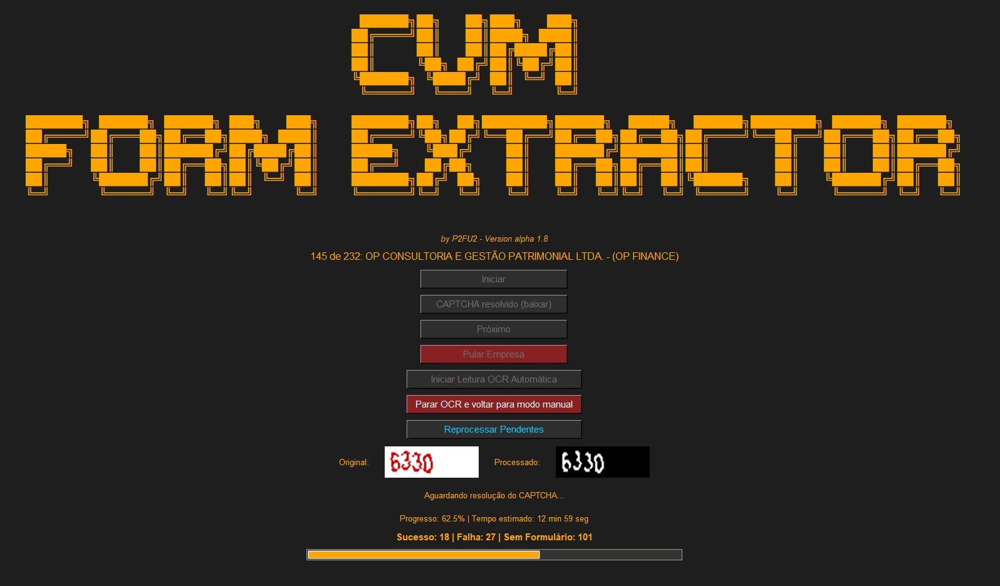

# CVM Form Extractor

O **CVM Form Extractor** é uma ferramenta automatizada para baixar em massa os **Formulários de Referência** do site da CVM (Comissão de Valores Mobiliários), mesmo quando há obstáculos como CAPTCHAs. Ele foi criado para facilitar auditorias, pesquisas, compliance e extração de dados públicos de forma eficiente, com interface gráfica amigável e recursos avançados de OCR.

## 🚀 Por que este projeto foi criado?

- **Automatizar tarefas repetitivas** de download de formulários públicos da CVM.
- **Contornar CAPTCHAs simples** usando OCR e técnicas de processamento de imagem.
- **Facilitar auditorias, compliance e análise de dados** para profissionais do mercado financeiro, advogados, pesquisadores e jornalistas.
- **Gerar logs e diagnósticos visuais** para rastreabilidade e melhoria contínua do processo.

## 🛠️ Funcionalidades

- Interface gráfica moderna e responsiva (Tkinter).
- Download automático de PDFs dos formulários de referência.
- Resolução automática de CAPTCHAs usando Tesseract OCR e OpenCV.
- Possibilidade de operação manual (caso o OCR falhe).
- Diagnóstico visual dos CAPTCHAs processados (HTML com imagens originais e processadas).
- Log detalhado de todas as operações (sucesso, falha, sem formulário).
- Reprocessamento inteligente: só tenta novamente empresas que realmente podem ser baixadas.
- Barra de progresso, tempo estimado e contadores de sucesso, falha e "sem formulário".

## 📦 Requisitos

- **Python 3.10 ou superior**
- **Google Chrome** instalado
- **ChromeDriver** compatível com sua versão do Chrome
- **Tesseract OCR** instalado no sistema

### Instale as dependências Python:

pip install -r requirements.txt

## 📂 Estrutura Esperada

- `CVM_Links.xlsx`: arquivo Excel com os nomes das empresas e seus links, alternando linha a linha (nome, link, nome, link...).
- `formularios/`: pasta onde os PDFs baixados serão salvos.
- `captchas/`: pasta onde as imagens dos CAPTCHAs (originais e processadas) serão salvas.
- `resultado_extracao.log`: log detalhado das operações.
- `diagnostico_captchas.html`: relatório visual dos CAPTCHAs processados.

## 🧭 Como criar o arquivo `CVM_Links.xlsx`

1. Acesse: [https://sistemas.cvm.gov.br/consultas.asp](https://sistemas.cvm.gov.br/consultas.asp)
2. Clique em: [https://sistemas.cvm.gov.br/asp/cvmwww/cadastro/formcad.asp](https://sistemas.cvm.gov.br/asp/cvmwww/cadastro/formcad.asp)
3. Selecione o tipo de participante desejado (ex: Consultores de Valores Mobiliários).
4. No navegador, pressione `F12` para abrir o DevTools e vá na aba **Console**.
5. Cole e execute:

    const links = Array.from(document.querySelectorAll("a.MenuItemP"));
    const data = links.map(a => `${a.innerText.trim()}\n${a.href}`);
    console.log(data.join('\n\n'));

6. Copie o resultado e cole no Excel, salvando como `CVM_Links.xlsx`.

## ▶️ Como usar (passo a passo)

1. **Instale as dependências**:

    pip install -r requirements.txt

2. **Garanta que o Tesseract está instalado** e disponível no PATH do sistema.
3. **Abra o terminal na pasta do projeto**.
4. **Execute o script**:

    python CVM\ Form\ Extractor\ Alpha\ v1.8.py

5. **Na interface gráfica**:
    - Clique em **Iniciar** para começar o processamento manual.
    - Clique em **Iniciar Leitura OCR Automática** para o modo automático.
    - Use **CAPTCHA resolvido (baixar)** se resolver manualmente o CAPTCHA.
    - Use **Pular Empresa** para ignorar uma empresa.
    - Use **Reprocessar Pendentes** para tentar novamente apenas as empresas que não tiveram sucesso e não são "sem formulário".
    - Veja o progresso, tempo estimado e contadores na tela.
    - Ao final, consulte o log e o diagnóstico HTML para análise detalhada.

## 📝 Resultados e Relatórios

- **`resultado_extracao.log`**: histórico detalhado de cada empresa processada (data, status, arquivo).
- **`diagnostico_captchas.html`**: relatório visual com imagens dos CAPTCHAs originais e processados, status do OCR e links para os arquivos.
- **`formularios/`**: PDFs baixados.
- **`captchas/`**: imagens dos CAPTCHAs.

## 🧠 Dicas para melhorar o OCR

- O script já faz pré-processamento (contraste, binarização, resize).
- Se o OCR falhar muito, tente ajustar a resolução do Tesseract ou treinar um modelo customizado.
- Veja o diagnóstico HTML para entender onde o OCR está errando.

## 🧩 Notas Técnicas

- O OCR é limitado a 4 dígitos (whitelist 0123456789).
- Usa PSM 6, 7, 8 e 13 para aumentar as chances.
- O script pula ou retenta automaticamente em caso de falha.
- O reprocessamento ignora empresas que não possuem formulário (otimização).
- O log e o diagnóstico HTML são atualizados em tempo real.

## ❓ Dúvidas Frequentes

- **O programa pula empresas que não têm formulário?**
  - Sim, elas são identificadas e não entram no reprocessamento.
- **Posso rodar em outro sistema operacional?**
  - Sim, desde que tenha Python, Chrome, ChromeDriver e Tesseract instalados.
- **O OCR não está funcionando bem, o que fazer?**
  - Veja o diagnóstico HTML, ajuste o pré-processamento ou treine o Tesseract.

## 📌 Sobre

Este projeto foi criado para facilitar auditoria, compliance e extração em massa de dados públicos da CVM, superando obstáculos artificiais como CAPTCHAs simples.

## 📃 requirements.txt

Veja abaixo o arquivo de dependências recomendado.

pandas>=1.4,<2.3
requests>=2.28,<3.0
undetected-chromedriver>=3.5,<4.0
selenium>=4.8,<5.0
Pillow>=9.0,<11.0
opencv-python>=4.5,<5.0
pytesseract>=0.3,<0.4
numpy>=1.21,<2.0

tkinter geralmente já vem com o Python, não precisa instalar via pip

